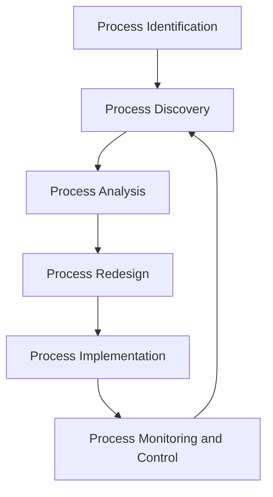

# Overview

Business process is a chain of events, activities and decisions

- involving several actors and objects
- triggered by a need
- and collectively leading to an outcome that is of value to a customer

Common Types of Processes

- Order to cash
- Quote to order
- Procure to pay
- Issue to resolution
- Application to approval

### What is Business Process Management?

Body of principles, methods, and tools to design, analyze, execute and monitor **business processs,** with the aim  of **improving** their performance.

- Improving Performance
- Process Perfomance
    - Three dimensions of process performance
        1. Time (Faster)
        2. Cost (Cheaper)
        3. Quality (Better)

### **Why BPM?**

The first rule of any technology used in a business is that automation applied to an efficient operation will magnify the efficiency.

어떤 기술이든 비즈니스에 사용될 때 첫 번째 규칙은, **효율적인 작업에 자동화를 적용하면 그 효율성이 증대된다는 것**입니다.

The second is that automation applied to an inefficient operation will magnify the inefficency.

두 번째 규칙은, **비효율적인 작업에 자동화를 적용하면 그 비효율성도 증대된다는 것**입니다.

### The BPM Lifecycle

- **Process identification**
    1. **Designation step** ➡️ **Process Architecture**
        1. Enumerate main processes
        2. Determine process scope
    2. **Prioritizaiton step**(= Process selection) ➡️ **Prioritized Process Portfolio**
        
        Prioitize processes based on:
        
        - **Strategic Importance**: which processes have greaest impact on the organization’s strategic objectives?
        - **Health or Dysfunction**: which processes are in deepest trouble?
        - **Feasibility**: which processes are most susceptible to successful process management?
- **Process discovery :** Business process model
- **Process analysis**: Insights on weaknesses and their impact
    1. Qualitative process anaylsis
    2. Quantitative process anaylsis
- **Process redesign ➡️** The Process Redesign Orbit
    - AS-IS process model → **TO-BE process model**
- **Process implementation**: Executable process model
- **Process monitering and controling:** Conformance and performance insights